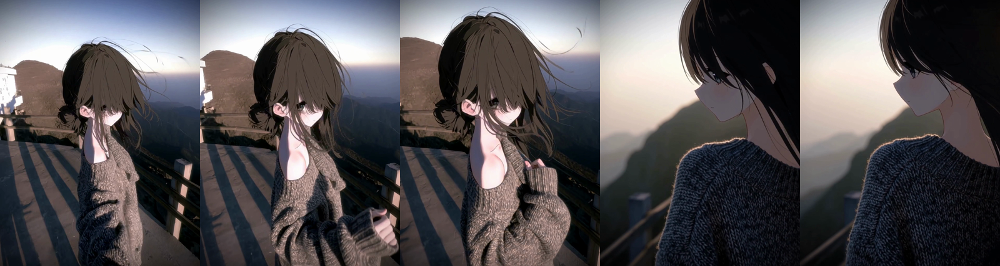

[中文说明](README.md) · **English**

---

# MiniMax H3 — 8 GB VRAM Workflows (three tiers)

Three runnable ComfyUI workflows tuned for **8 GB laptop GPUs**. Every parameter choice
has a measurement behind it; sources are listed at the end.

| File | Steps | Sampler | LoRA | TE-Speed | Measured, 10 s clip |
|---|---|---|---|---|---|
| `H3_Quality.json` | 20 | `res_multistep` | none | off | **33.8–43.5 min** |
| **`H3_Balanced.json`** | **8** | `euler` | turbo @1.0 | off | **14.3 min** |
| `H3_Fast.json` | 4 | `euler` | turbo @1.0 | off | ~9 min |

**Use Balanced day to day.** At the same seed, 8 and 20 steps produce nearly the same
composition, and 8 steps costs 1/2.5 of the time.

---

## Preview

**Balanced (8 steps) — the recommended daily driver.** Five timestamps: push-in → hand
close-up → cut → profile.



<sub>
Quality (20 steps): [preview](preview/H3_Quality.png) ·
Fast (4 steps): [preview](preview/H3_Fast.png)
</sub>

> The sample clips use the author's own reference image. In the published workflows
> `LoadImage` points at ComfyUI's bundled `example.png` — **swap in your own image.**

---

## 1. Models you need first

Drop these into the matching `models/` subfolder:

| Role | Filename | Where |
|---|---|---|
| Diffusion model | `minimax_h3_fl2va_pruned_int8_convrot.safetensors` | `models/diffusion_models/` |
| Text encoder | `qwen3vl_32b_minimax_h3_nvfp4_awq.safetensors` | `models/text_encoders/` |
| Video VAE | `minimax_h3_video_vae_int8_convrot.safetensors` | `models/vae/` |
| Audio VAE | `minimax_h3_audio_vae_fp32.safetensors` | `models/vae/` |
| turbo LoRA | `minimax_h3_turbo_v4_step600_comfyui_T8-convert.safetensors` | `models/loras/` |

> **On quantization:** prefer `int8_convrot` for the diffusion model (needs PyTorch cu130);
> fall back to `fp8_scaled` if it will not run. The `nvfp4_awq` text encoder **does not
> need a Blackwell card**, and it is 10.7 GiB smaller than the `int8` one — which matters
> a great deal on a 16 GB machine.
>
> **Quality carries no LoRA**, so that workflow does not need the LoRA file.

### Custom nodes required

| Node | Source | Why |
|---|---|---|
| `MiniMaxLowVRAMAttention` / `MiniMaxChunkFeedForward` | ComfyUI built-in | VRAM reduction (source-level lossless) |
| `ModelAttentionBackend` | ComfyUI built-in | switch to the comfy-kitchen attention backend |
| `VHS_VideoCombine` | **ComfyUI-VideoHelperSuite** | video output (see §6) |
| `MiniMaxH3SigmaShift` | ComfyUI built-in | explicit shift control |

---

## 2. Launch flags

```
--disable-pinned-memory        <- REQUIRED on a 16 GB machine
```

**Do not add:**
- `--use-sage-attention` — on sm_120 it is *slower* than kitchen and 2.4× less accurate,
  and it disables backend selection entirely
- `--use-flash-attention` — unavailable on sm_120
- `--fast` / `--fp16-unet` — H3 computes in bf16, there is no fp16 path; you get black frames

---

## 3. How to use

1. Drag the json into ComfyUI
2. **Replace `LoadImage` with your own image** (it defaults to ComfyUI's `example.png`,
   which is only a placeholder)
3. **Write your own prompt — but keep this structure:**

```
For the target video, at 0.00 seconds into the target video, <Picture 1> (from [Shot 1]) is fully referenced.

integrated_multimodal_description: [Shot 1] ... The camera pushes in with small amplitude
at slow speed toward <a concrete target>, and comes to rest at a medium shot. ... [Shot 2] At 00:06.000,
the camera cuts to ...

overall_soundscape: ...

non_diegetic_music: ...
```

**The three prompt traps that cost the most time — all measured:**

| Trap | Consequence |
|---|---|
| Writing only `[Shot 1]` for a 10 s clip | the tail has nothing to describe, so **the model improvises scenery and the subject disappears** |
| Describing camera amplitude and speed but **no target** | the model has no stop condition and **pushes until the subject leaves frame** |
| Asking to "keep the composition unchanged" **and** to push in | **self-contradictory** — composition necessarily changes under a camera move |

4. **Restart ComfyUI before every run** (see §5)
5. Run

---

## 4. Resolution: leave the "megapixels" number alone until you read this

Official constraints: **short side ≤ 768, area ≤ 768×1344, multiples of 32.**

`ResolutionSelector`'s megapixel dial is a **trap** — the same MP value yields different
short sides depending on the aspect ratio:

| Ratio | MP to get short side = 768 | Actual output |
|---|---|---|
| 1:1 | 0.5625 | 768×768 |
| **3:4 (default)** | **0.75** | **768×1024** |
| 4:3 | 0.75 | 1024×768 |
| 9:16 | 0.959 | 768×1344 |
| 16:9 | 0.959 | 1344×768 |
| 2:3 | 0.844 | 768×1152 |

**Setting 1.0 MP with 3:4 gives 896×1184 — short side 896, outside the trained range, and
the picture gets *worse*.**

> The 9:16 768×1344 (0.984 MP) is the legal maximum, but on a 16 GB machine it measurably
> fell into thrashing (GPU power dropped from 80 W to a flat 34 W). Try it only with more RAM.

---

## 5. Restart ComfyUI before every run

This is the **single highest-value habit**, worth far more than any node-level tweak:

| ComfyUI session state | per block | 10 s clip |
|---|---|---|
| **freshly restarted** | **0.9–6 s** | **34–44 min** |
| after ~1.7 h of continuous sessions | **212 s** | **~12 h** |

**How to tell you are degrading: watch `nvidia-smi` power draw.**

- healthy sampling: **64–98 W**
- thrashing: a **flat 34–36 W** while `utilization.gpu` still reads 99% (that counter
  counts memory-shuffling kernels too)

**Sample it in a loop and stop when it goes flat — do not wait it out.**

---

## 6. Why the output node is `VHS_VideoCombine` and not `SaveVideo`

`SaveVideo` has a `crf` control, but **its re-encode path fails whenever the video's width
or height is odd**:

```
avcodec_open2("libx264", {})   <- fails with NO options at all
```

**It is the dimensions, not a broken encoder.** `video_types.py` hands the frame's
width/height to libx264 unchanged while setting `pix_fmt = "yuv420p"` — and `yuv420p`
subsamples chroma 2x2, so **both dimensions must be even**. libx264 returns `EINVAL (22)`,
and since PyAV opens the encoder lazily inside `encode()`, it surfaces as a generic
external-library error with no hint about dimensions.

Measured on the same PyAV (18.1.0) with no ComfyUI running: `64x64` and `1080x1920` open
fine; `65x63`, `63x65`, `65x65`, `1171x2532`, `1080x1441` all fail. Our reference image is
**1259 x 1672** — odd width. Reported upstream as
[ComfyUI #16544](https://github.com/Comfy-Org/ComfyUI/issues/16544).

`format=auto` is not a workaround: it "preserves the source stream", so **it cannot change
quality**, and the bitrate was pinned at 2067 kb/s.

`VHS_VideoCombine` shells out to the ffmpeg executable instead, and **its `crf` works**:

| Output node | Bitrate, same clip |
|---|---|
| `SaveVideo` (auto) | 2067 kb/s |
| **`VHS_VideoCombine` (crf=12)** | **10393 kb/s (×5.0)** |

Lower crf = higher quality, bigger file. **12 ≈ visually lossless**; 18–20 is fine if you
want smaller files (same test input: crf=12 → 570 KB, crf=19 → 287 KB, crf=40 → 40 KB).

---

## 7. Known limitations

- **Also measured on an RTX 4060 Laptop (sm_89)** (2026-09): at 4 steps / 5 s / 768x1024,
  pytorch attention 403.8 s, **comfy-kitchen 270.1 s**, sage 263.0 s.
  **kitchen beats pytorch by 1.5x on the 4060 too**, so this workflow's backend choice
  does not need to change per architecture. Still unmeasured there: 8-step and 20-step.
- Only 5 s and 10 s clips were measured. The official trained range is ~124–362 frames.
- **None of the three tiers uses TE-Speed** — it measured at only 18% saving, at the cost
  of a closed-source, unauditable lossy component.
- These are **not claimed to be optimal**. They are a reasonable, evidence-aligned starting point.

---

## 8. Where the evidence lives

Every parameter choice above has a measurement behind it. Scripts, raw data and
comparison images:

**https://github.com/FlowForgeLabAi/-h3-8gb-traps**

That repo contains the kitchen-vs-sage-vs-SDPA attention comparison, the per-key LoRA
applicability analysis (80.3%), a seconds-fast output-node probe that never loads a model,
and a 14-run × 33-field CSV.
